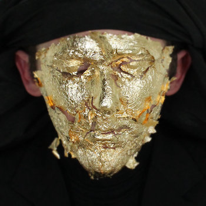
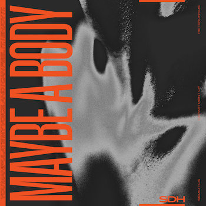
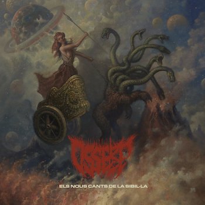
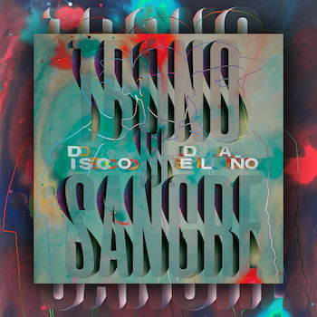
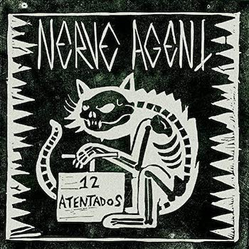
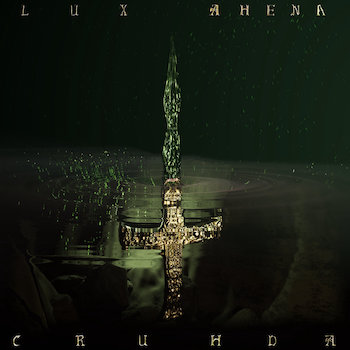
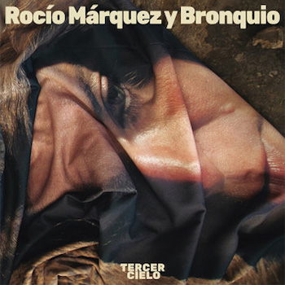
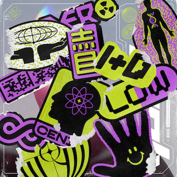

Tras muchas discusiones internas y un complejísimo sistema de votos, ya tenemos nuestros mejores discos del año. Como siempre un top ecléctico, casi indigesto, pero que aglutina todos los sonidos de los que hablamos habitualmente: experimentos imposibles, ruidera infernal, melodíass preciosista o canciones de contenido sesudo. No nos enrollamos más, aquí van los que consideramos los mejores discos de este 2022.

## Mejores discos de fuera

<AlbumItem position="20" title="Daniel Rossen - You Belong There" />
<AlbumItem position="19" title="Ghais Guevara - There Will Be No Super-Slave" />
<AlbumItem position="18" title="Watain - The Agony and Ecstasy of Watain" />
<AlbumItem position="17" title="Porcupine Tree - Closure / Continuation" />
<AlbumItem position="16" title="Petrol Girls - Baby" />

<AlbumItem
  position="15"
  title="foxtails - fawn"
>

</AlbumItem>
<AlbumItem
  position="14"
  title="Perfume Genius - Ugly Season"
>

  </AlbumItem>
<AlbumItem
  position="13"
  title="The Mall - Time Vehicle Earth"
>

</AlbumItem>
<AlbumItem
  position="12"
  title="Deathspell Omega - The Long Defeat"
>

</AlbumItem>
<AlbumItem
  position="11"
  title="Chat Pile - God's Country"
>

</AlbumItem>
<AlbumItem
  position="10"
  title="Viagra Boys - Cave World"
>

</AlbumItem>
<AlbumItem
  position="9"
  title="One Leg One Eye - ... and Take the Black Worm With Me"
>

</AlbumItem>
<AlbumItem
  position="8"
  title="Conjunto Primitivo - Morir y Renacer"
>

</AlbumItem>
<AlbumItem
  position="7"
  title="Coscradh - Nahanagan Stadial"
>

</AlbumItem>
<AlbumItem
  position="6"
  title="Cult of Luna - The Long Road North"
>

</AlbumItem>
<AlbumItem
  position="5"
  title="Kali Malone - Living Torch"
>

</AlbumItem>
<AlbumItem
  position="4"
  title="Verberis - Adumbration of the Veiled Logos"
>

</AlbumItem>
<AlbumItem
  position="3"
  title="Black Country, New Road - Ants From Up There"
>

</AlbumItem>
<AlbumItem
  position="2"
  title="Billy Woods - Aethiopes"
>

</AlbumItem>
<AlbumItem
  position="1"
  title="Birds In Row - Gris Klein"
>

</AlbumItem>

## Mejores discos de aquí

<AlbumItem
  position="15"
  title="Flash - Flash"
></AlbumItem>
<AlbumItem
  position="14"
  title="Rosalía - Motomami"
></AlbumItem>
<AlbumItem
  position="13"
  title="Sacco - Basa"
></AlbumItem>
<AlbumItem
  position="12"
  title="Orthodox - Proceed"
></AlbumItem>
<AlbumItem
  position="11"
  title="Margarita Quebrada - Gas Lágrima"
></AlbumItem>
<AlbumItem
  position="10"
  title="Isabel do Diego - Bestia Sagrada"
>

</AlbumItem>
<AlbumItem
  position="9"
  title="Semiotics Department of Heteronyms - Maybe A Body"
>

</AlbumItem>
<AlbumItem
  position="8"
  title="Osserp - Els nous cants de la Sibil·la"
>

</AlbumItem>
<AlbumItem
  position="7"
  title="Trono de Sangre - Disco del Año"
>

</AlbumItem>
<AlbumItem
  position="6"
  title="Nerve Agent - 12 Atentados"
>

</AlbumItem>
<AlbumItem
  position="5"
  title="Dena - Zure mugadun hutsune"
>

</AlbumItem>
<AlbumItem
  position="4"
  title="CRUHDA - Lux Ahena"
>

</AlbumItem>
<AlbumItem
  position="3"
  title="Rocío Marquez & BRONQUIO - Tercer Cielo"
>

</AlbumItem>
<AlbumItem
  position="2"
  title="Dame Area - Toda la mentira sobre Dame Area"
>

</AlbumItem>
<AlbumItem
  position="1"
  title="Erik Urano - Qubits"
>

</AlbumItem>

## Mejores discos de fuera por Rememorama

1. Viagra Boys - Cave World
2. Billy Woods - Aethiopies
3. Porcupine Tree - Closure / Continuation
4. Daniel Rossen - You Belong There
5. Meat Wave - Malign Hex
6. Danger Mouse & Black Thought - Cheat Codes
7. Brutus - Unison Life
8. White Ward - False Light
9. Show Me The Body - Trouble The Water
10. Black Country, New Road - Ants Up There

## Mejores discos de aquí por Rememorama

1. Erik Urano - Qbits
2. Rocío Marquez & BRONQUIO - Tercer Cielo
3. Rosalía - Motomami
4. Trono de Sangre - Disco del año
5. Dena - Zure mugadun hutsune
6. Semiotics Department of Heteronyms - Maybe A Body
7. Los Punsetes - AFDTRQHOT
8. Biznaga - Bremen No Existe
9. Moura - Axexan, espreitan
10. CRUHDA - Lux Aena

## Mejores discos de fuera por Jorgenius

1. Kali Malone - Living Torch
2. Black Country, New Road - Ants Up There
3. foxtails - fawn
4. Ghais Guevara - There Will Be No Super-Slave
5. Birds In Row - Gris Klein
6. Honningbarna - Animorphs
7. Perfume Genius - Ugly Season
8. High Vis - Trauma Bonds
9. Chat Pile - God's Country
10. White Ward - False Light

## Mejores discos de aquí por Jorgenius

1. Rocío Marquez & BRONQUIO - Tercer Cielo
2. Nerve Agent - 12 Atentados
3. Flash - Flash
4. Dame Area - Toda la mentira sobre Dame Area
5. Marina Herlop - Pripyat
6. Trono de Sangre - Disco del año
7. Erik Urano - Qbits
8. Dena - Zure mugadun hutsune
9. CRUHDA - Lux Aena
10. Osserp - Els nous cants de la Sibil·la

## Mejores discos de fuera por Psichoboy

1. Conjunto Primitivo - Morir y Renacer
2. The Mall - Time Vehicle Earth
3. Petrol Girls - Baby
4. The Soft Moon - Exister
5. Symptom Error - Ex Crisis
6. The Afghan Whigs - How Do You Burn?
7. Otoboke Beaver - Super Champon
8. Pablo Bozzi - Ghost of Chance
9. Celeste - Assassine(s)
10. Chat Pile - God's Country

## Mejores discos de aquí por Psichoboy

1. Dame Area - Toda la mentira sobre Dame Area
2. CRUHDA - Lux Ahena
3. Ofelia Ortodoxa - Ultra Culto
4. Dame Area - Esto Me Pertenece
5. Semiotics Department of Heteronyms - Maybe A Body
6. Sistema de Entretenimiento - Sistema de Entretenimiento
7. Asymetric 80 - Static Minds
8. Isabel Do Diego - Bestia Sagrada
9. \_blank - The Abolition Of Work
10. Escapismo - Segundo

## Mejores discos de fuera por Asbestos

1. One Leg One Eye - ... and Take the Black Worm With Me
2. Coscradh - Nahanagan Stadial
3. Verberis - Adumbration of the Veiled Logos
4. Dream Unending - Song of Salvation
5. Hissing - Hypervirulence Architecture
6. Menace Ruine - Nekyia
7. Cult of Luna - The Long Road North
8. Celestial Grave - Vitriolic Atonement
9. Negative Plane - The Pact
10. The Mary Wallopers - The Mary Wallopers

## Mejores discos de aquí por Asbestos

1. Osserp - Els nous cants de la Sibil·la
2. Erik Urano - Qbits

## Mejores discos de fuera por Aris

1. Verberis - Adumbration of the Veiled Logos
2. Deathspell Omega - The Long Defeat
3. Watain - The Agony and Ecstasy of Watain
4. Cult of Luna - The Long Road North
5. Birds in Row - Gris Klein
6. Lifvsleda - Sepulkral Dedikation
7. Gevurah - Gehinnom
8. Imperial Triumphant - Spirit of Ecstasy
9. Coscradh - Nahanagan Stadial
10. Black Fucking Cancer - Procreate Inverse

## Mejores discos de aquí por Aris

1. Orthodox - Proceed
2. Dena - Zure mugadun hutsune
3. Bazka - Basoaren ilunean dantza
4. Vulk - Vulk ez da
5. Sacco - Basa

## Mejores discos de fuera por Tharandur

1. Billy Woods - Aethiopes
2. Birds in Row - Gris Klein
3. Black Country, New Road - Ants From Up There
4. PUP - The Unravelling of PUPTHEBAND
5. Chat Pile - God's Country
6. Kali Malone - Living Torch
7. Perfume Genius - Ugly Season
8. Soul Glo - Diaspora Problems
9. Celeste - Assasine(s)
10. Niños del Cerro - Suave Pendiente

## Mejores discos de aquí por Tharandur

1. Margarita Quebrada - Gas Lágrima
2. Erik Urano - Qubits
3. Dame Area - Toda la mentira sobre Dame Area
4. Isabel do Diego - Bestia Sagrada
5. Rocío Marquez & BRONQUIO - Tercer Cielo
6. Nerve Agent - 12 Atentados
7. CRUHDA - Lux Ahena
8. El Último Vecino - Juro y Prometo
9. Sacco - Basa
10. Dena - Zure mugadun hutsune
