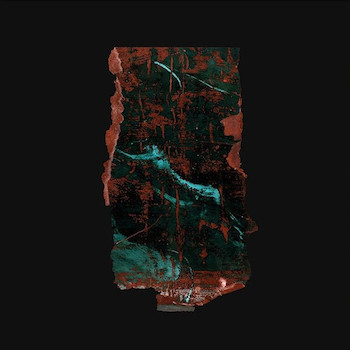
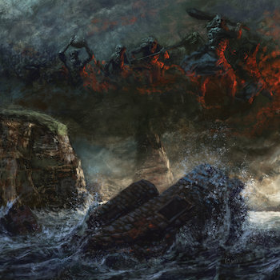
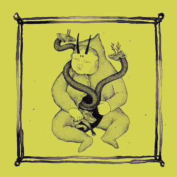
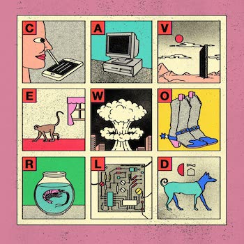
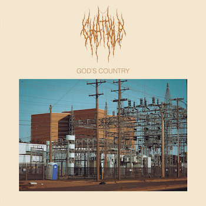
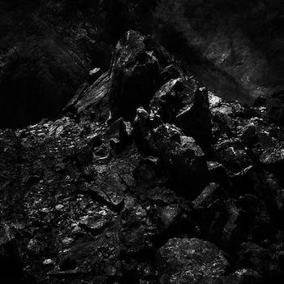
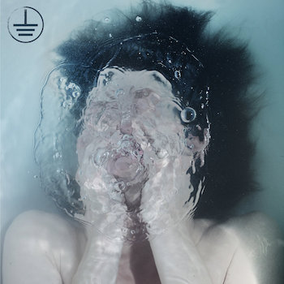
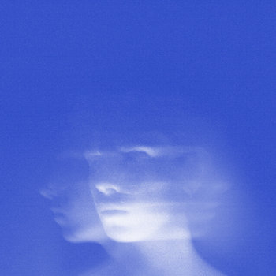

Tras muchas discusiones internas y un complejísimo sistema de votos, ya tenemos nuestros mejores discos del año. Como siempre un top ecléctico, casi indigesto, pero que aglutina todos los sonidos de los que hablamos habitualmente: experimentos imposibles, ruidera infernal, melodías preciosistas o canciones de contenido sesudo. No nos enrollamos más, aquí van los que consideramos los mejores discos de este 2022.

<AlbumList title="Mejores discos de fuera">
  <AlbumItem
    title="Gris Klein"
    artist="Birds In Row"
    tags={["post-hardcore","screamo"]}
  >

  </AlbumItem>

  <AlbumItem
    title="Aethiopes"
    artist="Billy Woods"
    tags={["abstract hip-hop"]}
  >

  </AlbumItem>

  <AlbumItem
    title="Ants From Up There"
    artist="Black Country, New Road"
    tags={["indie","post-rock","art rock"]}
  >

  </AlbumItem>

  <AlbumItem
    title="Adumbration of the Veiled Logos"
    artist="Verberis"
    tags={["black metal"]}
  >

  </AlbumItem>

  <AlbumItem
    title="Living Torch"
    artist="Kali Malone"
    tags={["drone"]}
  >

  </AlbumItem>

  <AlbumItem
    title="The Long Road North"
    artist="Cult of Luna"
    tags={["post-metal"]}
  >

  </AlbumItem>

  <AlbumItem
    title="Nahanagan Stadial"
    artist="Coscradh"
    tags={["black metal", "death metal"]}
  >

  </AlbumItem>

  <AlbumItem
    title="Morir y Renacer"
    artist="Conjunto Primitivo"
    tags={["electrónica", "synthpop", "latino"]}
  >

  </AlbumItem>

  <AlbumItem
    title="... and Take the Black Worm With Me"
    artist="One Leg One Eye"
    tags={["drone", "folk"]}
  >

  </AlbumItem>

  <AlbumItem
    title="Cave World"
    artist="Viagra Boys"
    tags={["dance punk"]}
  >

  </AlbumItem>

  <AlbumItem
    title="God's Country"
    artist="Chat Pile"
    tags={["sludge", "noise rock"]}
  >

  </AlbumItem>

  <AlbumItem
    title="The Long Defeat"
    artist="Deathspell Omega"
    tags={["black metal"]}
  >

  </AlbumItem>

  <AlbumItem
    title="Time Vehicle Earth"
    artist="The Mall"
    tags={["ebm", "synth punk"]}
  >

  </AlbumItem>

  <AlbumItem
    title="Ugly Season"
    artist="Perfume Genius"
    tags={["art pop", "experimental"]}
  >

  </AlbumItem>

  <AlbumItem
    artist="foxtails"
    title="fawn"
    tags={["screamo", "post-hardcore"]}
  >

  </AlbumItem>

</AlbumList>

<AlbumList title="Mejores discos de aquí">

<AlbumItem
  artist="Erik Urano"
  title="Qubits"
  tags={["hip-hop", "grime"]}
>

</AlbumItem>

<AlbumItem
  artist="Dame Area"
  title="Toda la mentira sobre Dame Area"
  tags={["ebm", "industrial"]}

>

</AlbumItem>

<AlbumItem
  artist="Rocío Marquez & BRONQUIO"
  title="Tercer Cielo"
  tags={["flamenco","electrónica"]}
>

</AlbumItem>

<AlbumItem
  artist="CRUHDA"
  title="Lux Ahena"
  tags={["electrónica", "dark ambient"]}
>

</AlbumItem>

<AlbumItem
  artist="Dena"
  title="Zure mugadun hutsune"
  tags={["post-hardcore", "screamo"]}
>

</AlbumItem>

<AlbumItem
  artist="Nerve Agent"
  title=" 12 Atentados"
  tags={["punk", "electrónica"]}
>

</AlbumItem>

<AlbumItem
  artist="Trono de Sangre"
  title="Disco del Año"
  tags={["post-hardcore"]}
>

</AlbumItem>

<AlbumItem
  artist="Osserp"
  title="Els nous cants de la Sibil·la"
  tags={["death metal"]}
>

</AlbumItem>

<AlbumItem
  artist="Semiotics Department of Heteronyms"
  title="Maybe A Body"
  tags={["darkwave", "synthpop"]}
>

</AlbumItem>
<AlbumItem
  artist="Isabel do Diego"
  title="Bestia Sagrada"
  tags={["flamenco","experimental"]}
>

</AlbumItem>
</AlbumList>

## Mejores discos de fuera por Rememorama

1. Viagra Boys - Cave World
2. Billy Woods - Aethiopies
3. Porcupine Tree - Closure / Continuation
4. Daniel Rossen - You Belong There
5. Meat Wave - Malign Hex
6. Danger Mouse & Black Thought - Cheat Codes
7. Brutus - Unison Life
8. White Ward - False Light
9. Show Me The Body - Trouble The Water
10. Black Country, New Road - Ants Up There

## Mejores discos de aquí por Rememorama

1. Erik Urano - Qbits
2. Rocío Marquez & BRONQUIO - Tercer Cielo
3. Rosalía - Motomami
4. Trono de Sangre - Disco del año
5. Dena - Zure mugadun hutsune
6. Semiotics Department of Heteronyms - Maybe A Body
7. Los Punsetes - AFDTRQHOT
8. Biznaga - Bremen No Existe
9. Moura - Axexan, espreitan
10. CRUHDA - Lux Aena

## Mejores discos de fuera por Jorgenius

1. Kali Malone - Living Torch
2. Black Country, New Road - Ants Up There
3. foxtails - fawn
4. Ghais Guevara - There Will Be No Super-Slave
5. Birds In Row - Gris Klein
6. Honningbarna - Animorphs
7. Perfume Genius - Ugly Season
8. High Vis - Trauma Bonds
9. Chat Pile - God's Country
10. White Ward - False Light

## Mejores discos de aquí por Jorgenius

1. Rocío Marquez & BRONQUIO - Tercer Cielo
2. Nerve Agent - 12 Atentados
3. Flash - Flash
4. Dame Area - Toda la mentira sobre Dame Area
5. Marina Herlop - Pripyat
6. Trono de Sangre - Disco del año
7. Erik Urano - Qbits
8. Dena - Zure mugadun hutsune
9. CRUHDA - Lux Aena
10. Osserp - Els nous cants de la Sibil·la

## Mejores discos de fuera por Psichoboy

1. Conjunto Primitivo - Morir y Renacer
2. The Mall - Time Vehicle Earth
3. Petrol Girls - Baby
4. The Soft Moon - Exister
5. Symptom Error - Ex Crisis
6. The Afghan Whigs - How Do You Burn?
7. Otoboke Beaver - Super Champon
8. Pablo Bozzi - Ghost of Chance
9. Celeste - Assassine(s)
10. Chat Pile - God's Country

## Mejores discos de aquí por Psichoboy

1. Dame Area - Toda la mentira sobre Dame Area
2. CRUHDA - Lux Ahena
3. Ofelia Ortodoxa - Ultra Culto
4. Dame Area - Esto Me Pertenece
5. Semiotics Department of Heteronyms - Maybe A Body
6. Sistema de Entretenimiento - Sistema de Entretenimiento
7. Asymetric 80 - Static Minds
8. Isabel Do Diego - Bestia Sagrada
9. \_blank - The Abolition Of Work
10. Escapismo - Segundo

## Mejores discos de fuera por Asbestos

1. One Leg One Eye - ... and Take the Black Worm With Me
2. Coscradh - Nahanagan Stadial
3. Verberis - Adumbration of the Veiled Logos
4. Dream Unending - Song of Salvation
5. Hissing - Hypervirulence Architecture
6. Menace Ruine - Nekyia
7. Cult of Luna - The Long Road North
8. Celestial Grave - Vitriolic Atonement
9. Negative Plane - The Pact
10. The Mary Wallopers - The Mary Wallopers

## Mejores discos de aquí por Asbestos

1. Osserp - Els nous cants de la Sibil·la
2. Erik Urano - Qbits

## Mejores discos de fuera por Aris

1. Verberis - Adumbration of the Veiled Logos
2. Deathspell Omega - The Long Defeat
3. Watain - The Agony and Ecstasy of Watain
4. Cult of Luna - The Long Road North
5. Birds in Row - Gris Klein
6. Lifvsleda - Sepulkral Dedikation
7. Gevurah - Gehinnom
8. Imperial Triumphant - Spirit of Ecstasy
9. Coscradh - Nahanagan Stadial
10. Black Fucking Cancer - Procreate Inverse

## Mejores discos de aquí por Aris

1. Orthodox - Proceed
2. Dena - Zure mugadun hutsune
3. Bazka - Basoaren ilunean dantza
4. Vulk - Vulk ez da
5. Sacco - Basa

## Mejores discos de fuera por Tharandur

1. Billy Woods - Aethiopes
2. Birds in Row - Gris Klein
3. Black Country, New Road - Ants From Up There
4. PUP - The Unravelling of PUPTHEBAND
5. Chat Pile - God's Country
6. Kali Malone - Living Torch
7. Perfume Genius - Ugly Season
8. Soul Glo - Diaspora Problems
9. Celeste - Assasine(s)
10. Niños del Cerro - Suave Pendiente

## Mejores discos de aquí por Tharandur

1. Margarita Quebrada - Gas Lágrima
2. Erik Urano - Qubits
3. Dame Area - Toda la mentira sobre Dame Area
4. Isabel do Diego - Bestia Sagrada
5. Rocío Marquez & BRONQUIO - Tercer Cielo
6. Nerve Agent - 12 Atentados
7. CRUHDA - Lux Ahena
8. El Último Vecino - Juro y Prometo
9. Sacco - Basa
10. Dena - Zure mugadun hutsune
