Termina el año y toca hacer balance de lo que ha dado de sí. En este programa, como es habitual, hacemos un repaso a los mejores discos de 2024, y el resultado es tan variado e inclasificable como siempre.

<AlbumList title="Mejores discos de 2024">
  <AlbumItem
    title="Solo Postres"
    artist="Ramper"
    tags={["post-rock", "slowcore"]}
  >

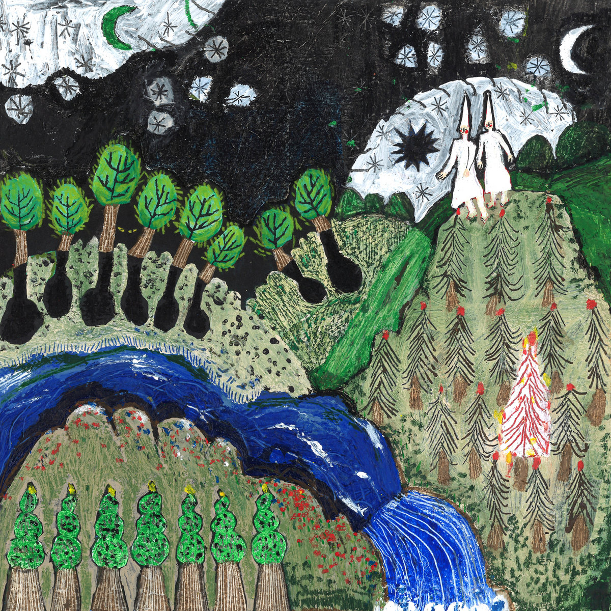

  </AlbumItem>

  <AlbumItem
    title="Toda la verdad sobre Dame Área"
    artist="Dame Área"
    tags={["industrial", "electrónica"]}
  >

  </AlbumItem>

  <AlbumItem
    title="She Reaches Out to She Reaches Out to She"
    artist="Chelsea Wolfe"
    tags={["darkwave", "trip-hop"]}
  >

  </AlbumItem>

  <AlbumItem
    title="Absolute Elsewhere"
    artist="Blood Incantation"
    tags={["death metal", "prog"]}
  >

  </AlbumItem>

  <AlbumItem
    title="Acelero"
    artist="Crizin da Z.O."
    tags={["hip hop", "funk", "glitch"]}
  >

    </AlbumItem>

    <AlbumItem
      title="The Healer"
      artist="SUMAC"
      tags={["sludge", "avant-garde"]}
    >

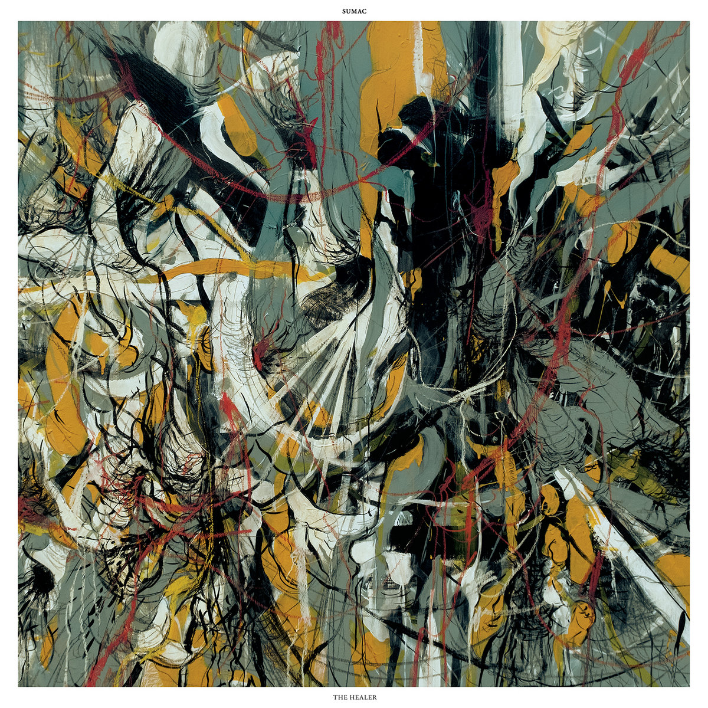

    </AlbumItem>

    <AlbumItem
      title="plastic death"
      artist="Glass Beach"
      tags={["indie", "post-hardcore", "prog"]}
    >

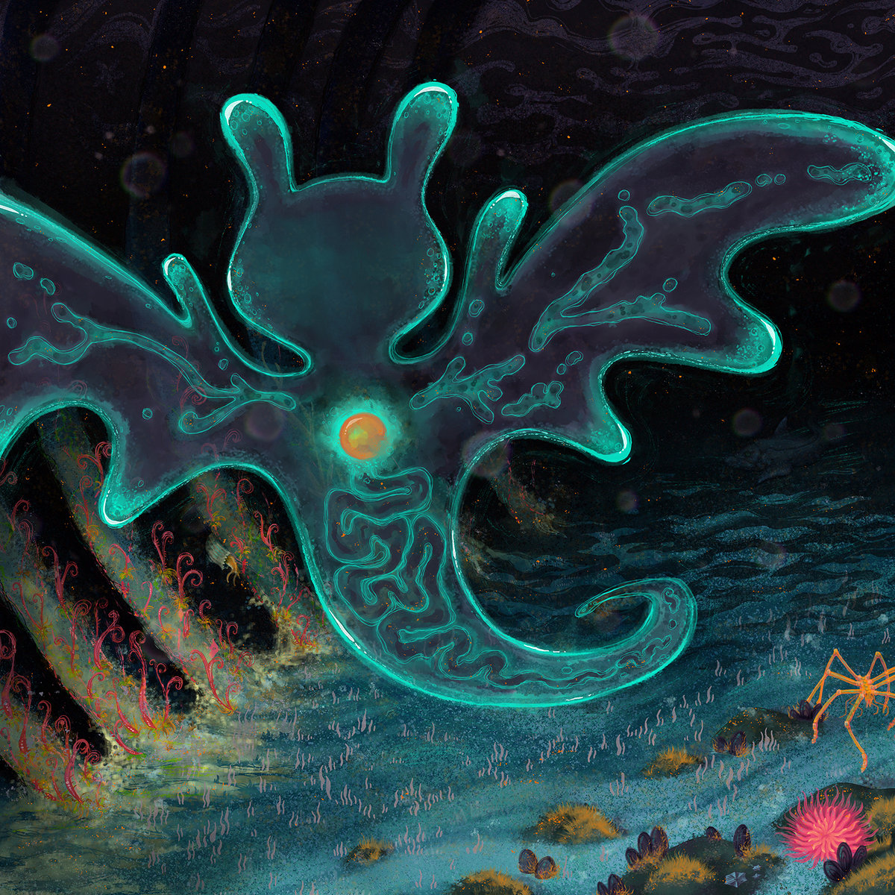

    </AlbumItem>

    <AlbumItem
      title="Cutting the Throat of God"
      artist="Ulcerate"
      tags={["death metal disonante", "death metal técnico"]}
    >

    </AlbumItem>

    <AlbumItem
      title="Lives Outgrown"
      artist="Beth Gibbons"
      tags={["folk", "chamber"]}
    >

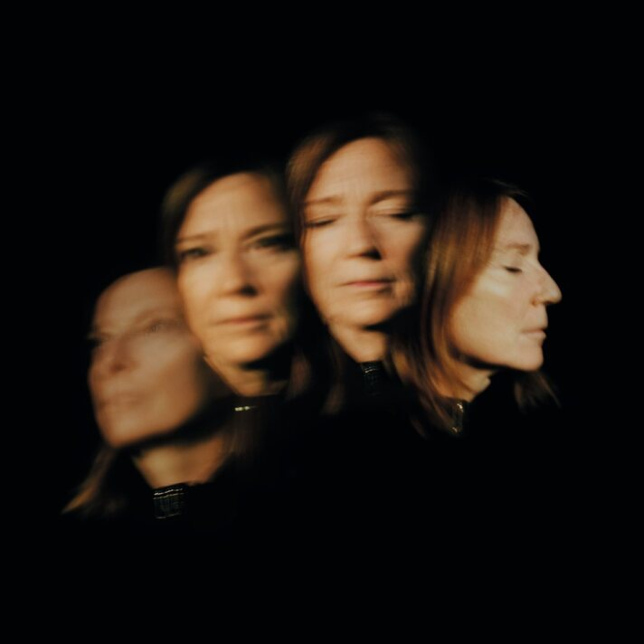

  </AlbumItem>

  <AlbumItem
    title="Burning in Celestial Poison"
    artist="Black Curse"
    tags={["black metal", "death metal"]}
  >

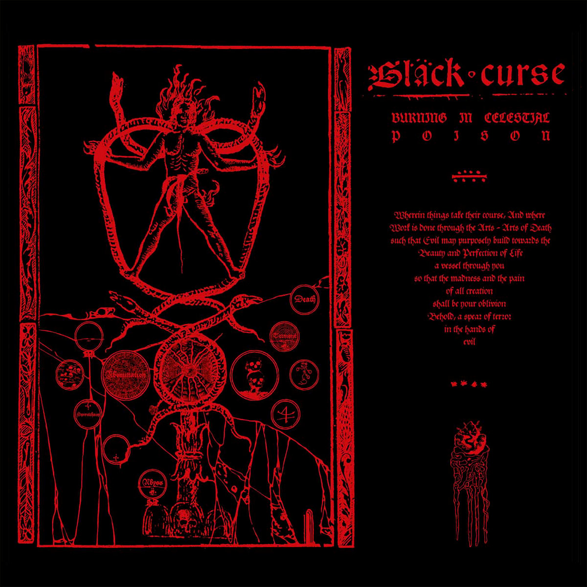

  </AlbumItem>

  <AlbumItem
    title="Joven Predicador"
    artist="Somos la Herencia"
    tags={["noise rock", "post-punk", "industrial"]}
  >

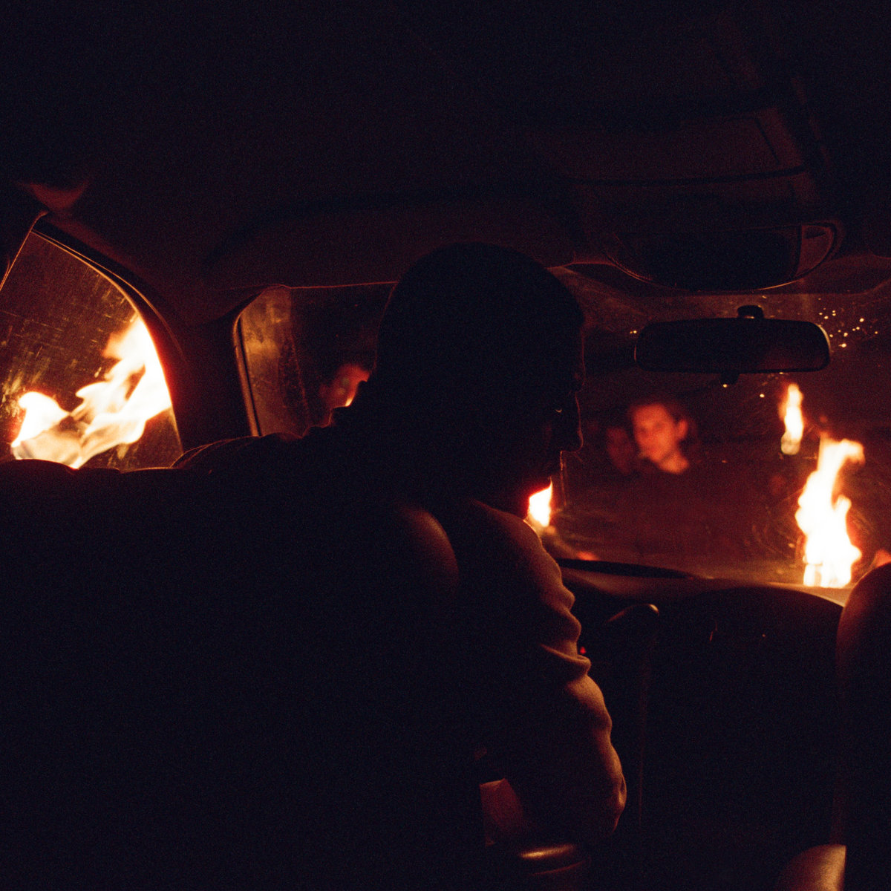

  </AlbumItem>

  <AlbumItem
    title="Muuntautuja"
    artist="Oranssi Pazuzu"
    tags={["black metal", "avant-garde"]}
  >

  </AlbumItem>

  <AlbumItem
    title="Sparagmos"
    artist="Spectral Voice"
    tags={["death doom metal"]}
  >

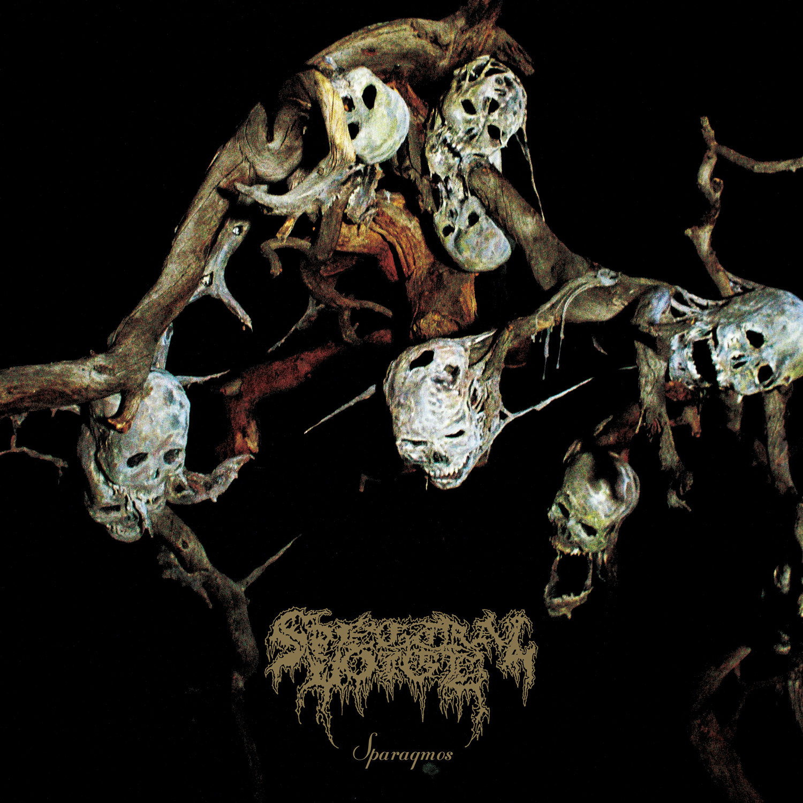

  </AlbumItem>

  <AlbumItem
    title="Fearless Movement"
    artist="Kamasi Washington"
    tags={["jazz fusion", "spiritual jazz"]}
  >

  </AlbumItem>

  <AlbumItem
    title="A Lonely Sinner"
    artist="samlrc"
    tags={["post rock"]}
  >

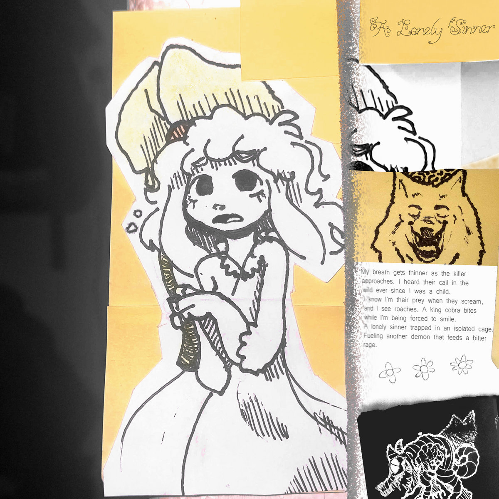

  </AlbumItem>

  <AlbumItem
    title="Tristwch Y Fenywood"
    artist="Tristwch Y Fenywood"
    tags={["darkwave", "neofolk"]}
  >

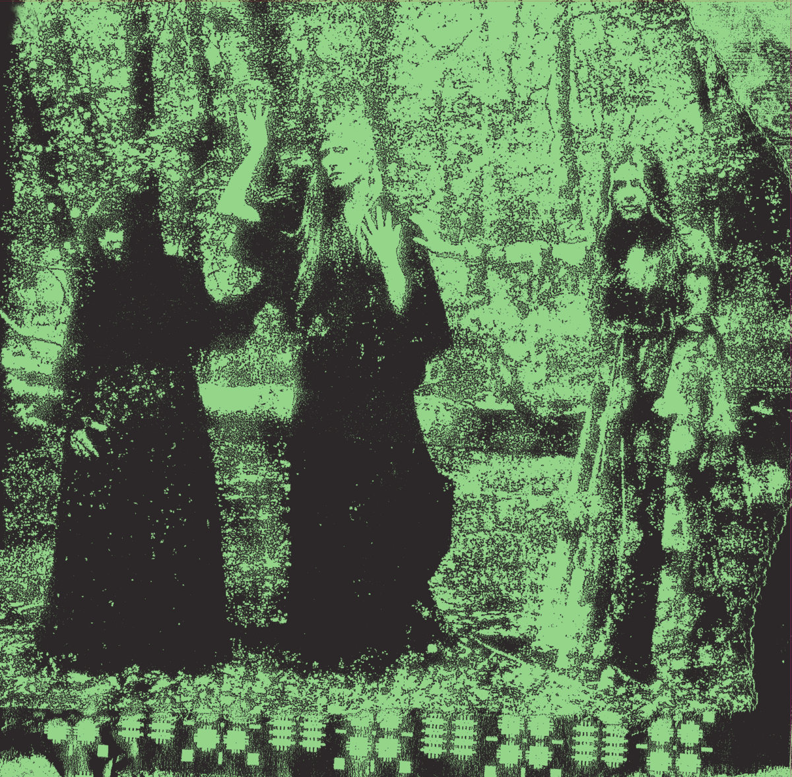

  </AlbumItem>

  <AlbumItem
    title="Vitriseptome"
    artist="Mitochondrion"
    tags={["death metal disonante", "death metal técnico"]}
  >

  </AlbumItem>

  <AlbumItem
    title="No Title as of 13 February 2024 28,340 Dead"
    artist="Godspeed You! Black Emperor"
    tags={["post-rock"]}
  >

  </AlbumItem>

  <AlbumItem
    title="Songs of a Lost World"
    artist="The Cure"
    tags={["gothic rock", "post punk"]}
  >

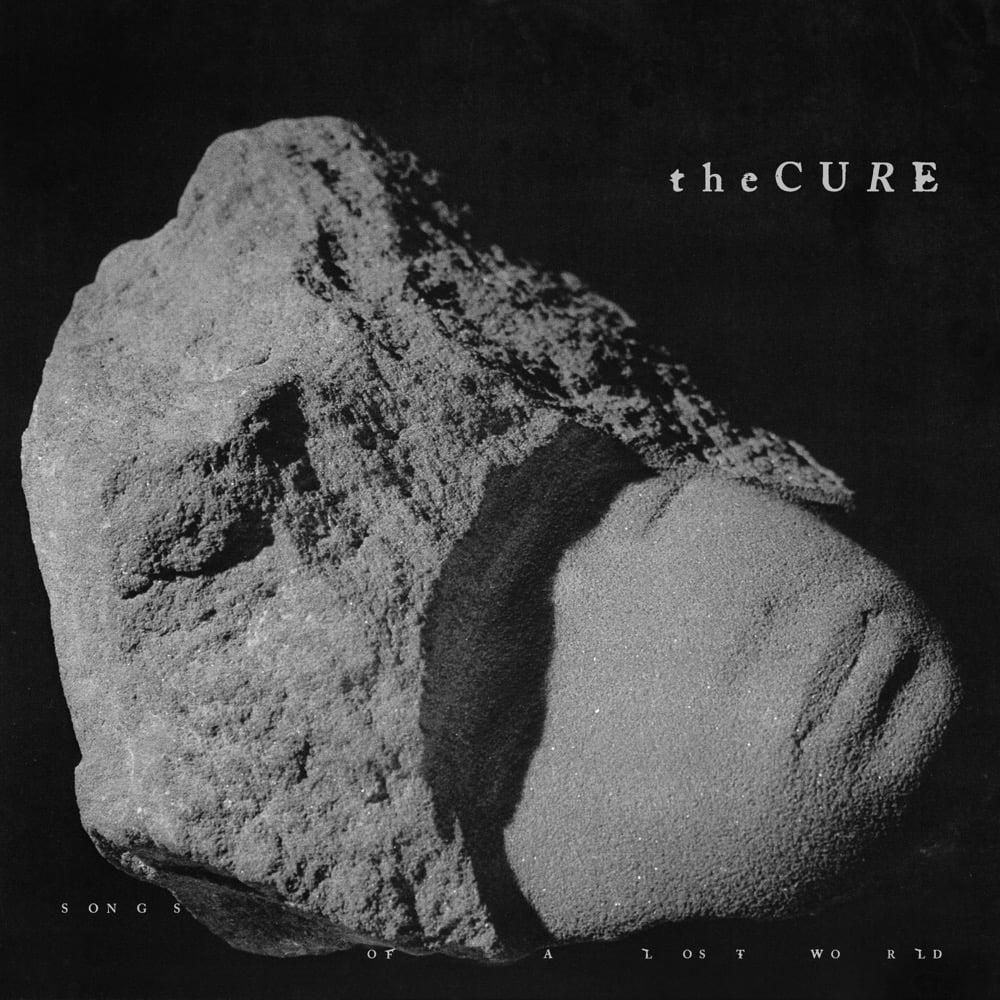

  </AlbumItem>

  <AlbumItem
    title="The Voluptuous Fire of Sin"
    artist="Deathless Void"
    tags={["black metal"]}
  >

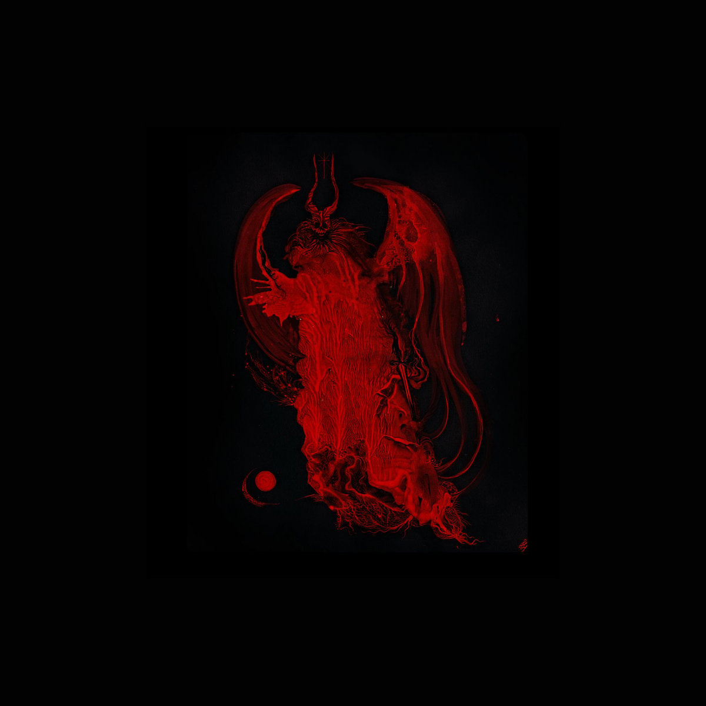

  </AlbumItem>

</AlbumList>
